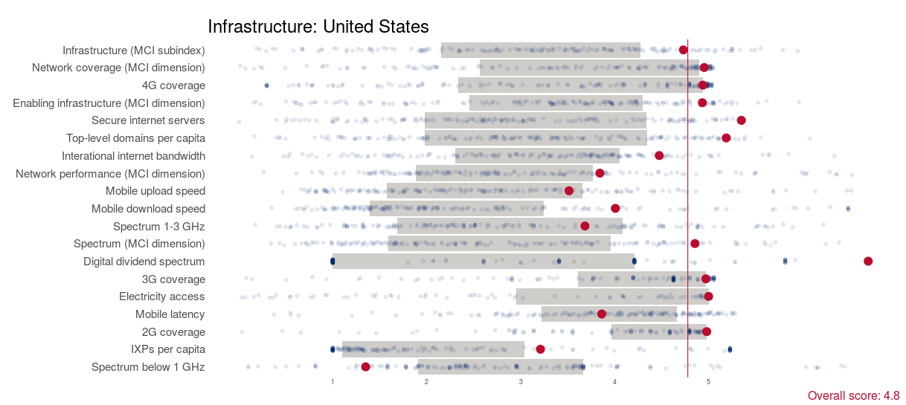
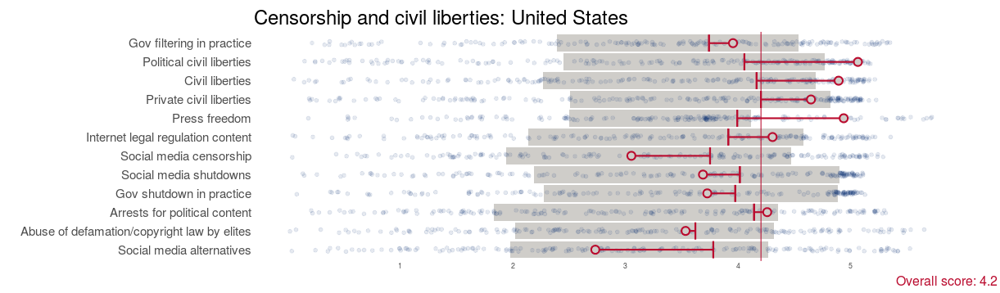
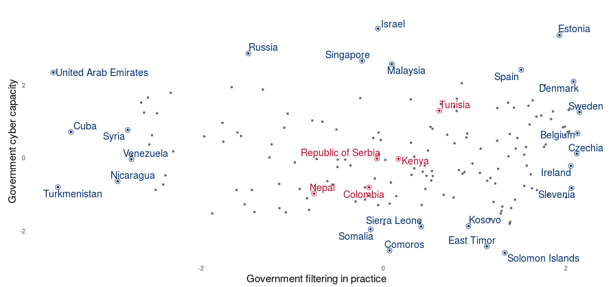
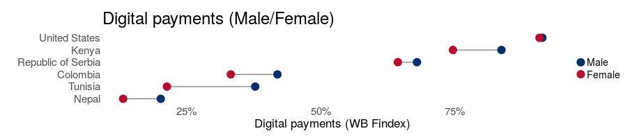
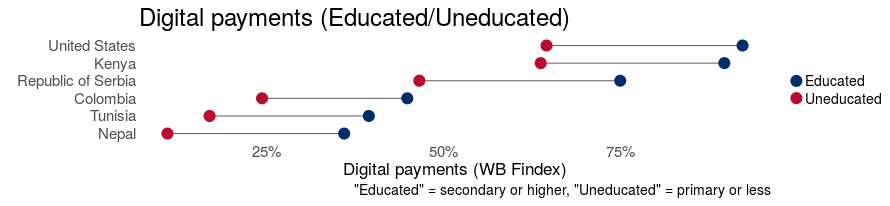

This is a little dated now, but it was a data visualization app intended to support the 
[Digital Ecosystem Country Assessment](https://web.archive.org/web/20241221214754/https://www.usaid.gov/digital-strategy/implementation-tracks/track1-adopt-ecosystem/digital-ecosystem-country-assessments) 
(DECA) initiative at USAID. Note that the data shown on the app is mostly from 2018-2019, but each plot contains links to where one can find updated datasets. You can see it in action at [shinyapps.io](https://ccjolley.shinyapps.io/DECA-app/).

The app shows three types of plots.

The first type you'll see when you open the app is the "summary plot", which shows a bunch of indicators (in a defined category) for one particular country. The aesthetic here was heavily influenced by the "Journey to Self-Reliance" dashboard that was used at USAID around 2018-2020. (Although I think my version looks nicer.) The selected country is indicated by a red dot, and all other countries are indicated by blue dots. All indices have been scaled to fit within this 0 to 5 range. By default, the gray shaded area indicates the middle 50% of countries (i.e., the 2nd and 3rd quartiles) -- there's a slider you can use to make this median group larger or smaller. So on this infrastructure plot you can see that some distributions (like 3G and 4G coverage) are highly skewed, because many countries have near-100% coverage, while others (like top-level domains per capita) are closer to normally-distributed. The virtical line shows an aggregate score that ranks how the selected country is doing overall (in this category) on a scale of 0-5.

I also tried implementing a "prediction" feature. The idea here is that many of these indices are highly correlated, so I wanted to check the extent to which individual scores could be predicted based on the first few principal components of the dataset containing _all_ indices in all categories. This plot shows the censorship and civil liberties scores for the United States (mostly taken from [Varieties of Democracy](https://v-dem.net/)). All indices have been defined so that "good" scores (meaning more liberal-democratic) are to the right. The short vertical lines show the predicted position (based on multiple linear regression on the first 5 principal components), and the circles show the actual score. You can see that a few of these scores (e.g., political civil liberties and press freedom) do better than expected, while others do worse, particularly social media censorship and "social media alternatives", which V-Dem defines as the prevalence of state-controlled social media platforms. The fact that all of the circles are empty, though, means that none of these differences are statistically significant -- significant departures from the multiple regression predictions are pretty hard to find. (I'm not convinced that this is because the predictions are great, though -- it's probably because the variances are so high that the null hypothesis is really hard to reject.)

The second kind of plot, the "scatter plot" is my favorite. Here we're looking at just a pair of indices and comparing them for every country in the dataset. You can select a few highlight countries (shown in red); extreme examples are labeled in blue. In this case we're comparing governmental cyber capacity (y-axis) with the extent to which governments implement content filtering (x-axis). So you can see countries that are highly capable but not prone to censorship (e.g., Estonia), countries that don't censor but probably lack the capability (e.g., Solomon Islands), countries that are highly capable and filter a lot (e.g., United Arab Emirates), and countries that don't have impressive cyber capabilities but _still_ go all in on censorship (e.g., Turkmenistan). In this case, all the highlighted countries are somewhere in-between.

The "gap plot" tries to illustrate and compare inequities within and between a user-defined set of countries, drawing mostly on the World Bank's Global Findex dataset. This example shows the gender gap in digital payments -- almost all countries have one, but the size of the gap varies widely, from almost nothing in the United States to rather large in Tunisia. 

Of course inequality can happen across many different axes, and in most countries the education gap is much larger than the gender gap. Educated Kenyans are almost as likely to use digital payments as educated Americans, and the absolute size of the education gap is similar across all countries compared. Unfortunately, the Findex data isn't granular enough to get into intersectional effects, so it's harder to quantify how digital access is impacted by combinations of gender, education, income, geography, etc.

After 2020, this prototype dashboard was transitioned to a Tableau-based system that was maintaned on [usaid.gov](usaid.gov).
